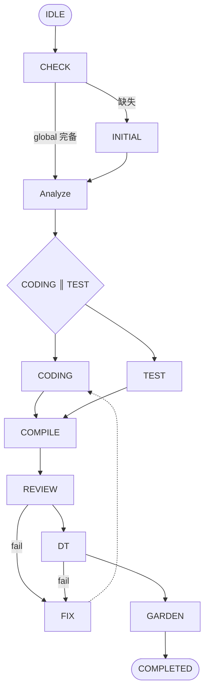

# Eathou Harness

> 多 Agent 协作系统。需求入口 → 编码 → 测试 → 编译 → 审查 → 部署测试 → 归档交付。

## 一目了然

```
用户需求 → Manager → Initial → Analyze → CODING ║ TEST → Compile → Review → DT → Gardening → 交付
```

- **Manager**：编排中枢，调度所有 Agent
- **Initial**：初始化，扫描生成全局基础文件（API列表、数据模型、架构文档）
- **Analyze**：需求分析，拆解为 feature → 精确task
- **Coding**：按 task 实现代码
- **Test**：按 task 编写测试
- **Compile**：编译 + 测试
- **Review**：代码审查（严重问题必须清零）
- **DT**：启动应用，验证 API 功能
- **Gardening**：归档整理，更新全局文件

## 核心流程

### 流程图（Mermaid）


### TDD 变体
Coding 和 Test **并行**执行，基于 Analyze 输出的精确 task：
- Coding 按 coding_task.md 实现（精确到类路径、方法名、出入参）
- Test 按 test_task.md 编写测试（精确到断言条件）

## 文件结构

```
artifacts/
├── global/                    # 全局文件（跨需求）
│   ├── api_list.yaml
│   ├── data_model.yaml
│   └── architecture.md
└── artifact-{demand}-{YYYY-mm-dd}/   # 需求目录
    ├── 02_analyze/
    │   ├── feature_list.json
    │   ├── coding_task.md
    │   └── test_task.md
    ├── 03_coding/            # 源码
    ├── 04_test/             # 测试
    ├── 05_compile/         # 编译结果
    ├── 06_reviewing/       # 审查报告
    ├── 07_dt/              # API测试
    └── 08_gardening/       # 归档
```

## 信号机制

- `.complete`：各阶段完成信号（空文件）
- 验证通过后 Manager 写入 `approve: timestamp`
- 验证不通过：删除信号，责令 Agent 继续

## 完成标准

| 阶段 | 标准 |
|------|------|
| Initial | api_list.yaml + data_model.yaml + architecture.md 存在 |
| Analyze | feature_list.json + coding_task.md + test_task.md |
| Coding | coding_task.md 中所有 `[ ]` → `[x]` |
| Test | test_task.md 中所有 `[ ]` → `[x]` |
| Compile | status = pass |
| Review | issue.json 中 severe_count = 0 |
| DT | pass_rate = 100% |
| Gardening | final_report.md + changelog.json |

## Review 审查标准

- **严重**：影响运行逻辑/健壮性 → 必须清零
- **一般**：代码规范问题
- **提示**：风格建议

## Harness 思想

### 1. 强制执行验证
- 关键阶段**必须执行命令**并获取控制台输出
- Compile 记录编译命令 + 输出（无错误的关键部分）
- DT 调用 API，记录实际响应
- 所有输出可追溯、可验证

### 2. 任务闭环
- task.md 中所有 `[ ]` 必须打勾变成 `[x]`
- Manager 验证：统计所有 TASK 标记，未完成则继续

### 3. 上下文完备
- 项目上下文必须完备才能开工
- Initial 扫描生成 global 文件（API/模型/架构）
- Analyze 解析 feature + 精确 task
- 上下文缺失 → 返回上一步补充

### 4. 汇报机制
- 所有 Subagent 由 Manager 创建
- 完成后向 Manager 汇报（生成 .complete 信号）
- Manager 验证通过才进入下一阶段

## DT 测试用例设计

基于 feature 设计，每个 feature 包含：
- 正向用例（期望成功）
- 负向用例（期望失败：参数错误、权限等）

## 状态文件

`artifacts/.state` 记录当前状态：
- current_state: 阶段名
- agents_status: 各 Agent 完成状态
- retry_counters: 重试计数

---

## 各 Agent 定义

见同名 .md 文件：
- `ManagerAgent.md` - 编排定义
- `InitialAgent.md` - 初始化定义
- `AnalyzeAgent.md` - 需求分析定义
- `CodingAgent.md` - 编码定义
- `TestAgent.md` - 测试定义
- `CompileAgent.md` - 编译定义
- `ReviewingAgent.md` - 审查定义
- `DTAgent.md` - 部署测试定义
- `GardeningAgent.md` - 归档定义